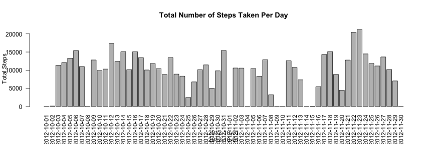

Reproducible Research Course Project 1
=======================================

### Loading the data  
The variables included in this dataset ("activity.csv") are:  
- __steps__: Number of steps taking in a 5-minute interval (missing values are coded as NA)  
- __date__: The date on which the measurement was taken in YYYY-MM-DD format  
- __interval__: Identifier for the 5-minute interval in which measurement was taken  

```r
activity <- read.csv("activity.csv") #data.frame
```


### What is the mean total number of steps taken per day?
Make a histogram of the total number of steps taken each day

```r
total <- tapply(activity$steps, activity$date, FUN=sum, na.rm=TRUE)
barplot(total, xlab=activity$date, ylab = "Total Steps", main="Total Number of Steps Taken Per Day", las=2)
```



Calculate and report the mean and median total number of steps taken per day

```r
mean(total)
```

```
## [1] 9354.23
```

```r
median(total)
```

```
## [1] 10395
```
*Mean total number of steps is 9354.2295082 and median total number of steps is 10395*


### What is the average daily activity pattern?

Make a time series plot (i.e. type = "l") of the 5-minute interval (x-axis) and the average number of steps taken, averaged across all days (y-axis)

```r
average <- tapply(activity$steps, activity$interval, FUN=mean, na.rm=TRUE)
plot(unique(activity$interval), average, type="l", ylab="Average Steps", xlab="Interval", main="Average Steps Per Interval")
```


Which 5-minute interval, on average across all the days in the dataset, contains the maximum number of steps?

```r
max(average)
```

```
## [1] 206.1698
```

```r
unique(activity$interval[which(average == max(average))])
```

```
## [1] 835
```
*The 835 sec(?) interval contains the maximum (206.1698113) number of average steps.*


### Imputing missing values

Calculate and report the total number of missing values in the dataset (i.e. the total number of rows with NAs)

```r
sum(is.na(activity))
```

```
## [1] 2304
```

Create a new dataset that is equal to the original dataset but with the missing data filled in by the mean of whole data

```r
activity$steps[is.na(activity$steps)] = mean(activity$steps, na.rm=TRUE)
```

Make a histogram of the total number of steps taken each day and Calculate and report the mean and median total number of steps taken per day. Do these values differ from the estimates from the first part of the assignment? What is the impact of imputing missing data on the estimates of the total daily number of steps?

```r
total2 <- tapply(activity$steps, activity$date, FUN=sum, na.rm=TRUE)
barplot(total2, xlab=activity$date, ylab = "Total Steps", main="Total Number of Steps Taken Per Day", las=2)
```


```r
mean(total2)
```

```
## [1] 10766.19
```

```r
median(total2)
```

```
## [1] 10766.19
```
*Both mean and median of the imputed data are higher than those of the data with missing (NA) values. Imputing the missing data may falsely elevate the estimates of the total daily number of steps.*


### Are there differences in activity patterns between weekdays and weekends?

Create a new factor variable in the imputed dataset with two levels -- "weekday" and "weekend" indicating whether a given date is a weekday or weekend day.

```r
activity$days <- weekdays(as.Date(activity$date))
activity$wkend <- ifelse(weekdays(as.Date(activity$date)) %in% c("Saturday", "Sunday"), "weekend", "weekday")
```

Make a panel plot containing a time series plot (i.e., type="l") of the 5-minute interval (x-axis) and the average number of steps taken, averaged across all weekday days or weekend days (y-axis). 

```r
wkday <- subset(activity, activity$wkend == "weekday")
avg_wkday <- tapply(wkday$steps, wkday$interval, FUN=mean, na.rm=TRUE)
wkend <- subset(activity, activity$wkend == "weekend")
avg_wkend <- tapply(wkend$steps, wkend$interval, FUN=mean, na.rm=TRUE)
par(mfrow=c(2,1))
plot(unique(wkday$interval), avg_wkday, type="l", ylab="Average Steps", xlab="Weekday", main="Average Steps Per Interval During Weekday or Weekend")
plot(unique(wkend$interval), avg_wkend, type="l", ylab="Average Steps", xlab="Weekend")
```


*There is higher average steps during the weekends (42.3664013) than during the weekdays (35.6105812)*
